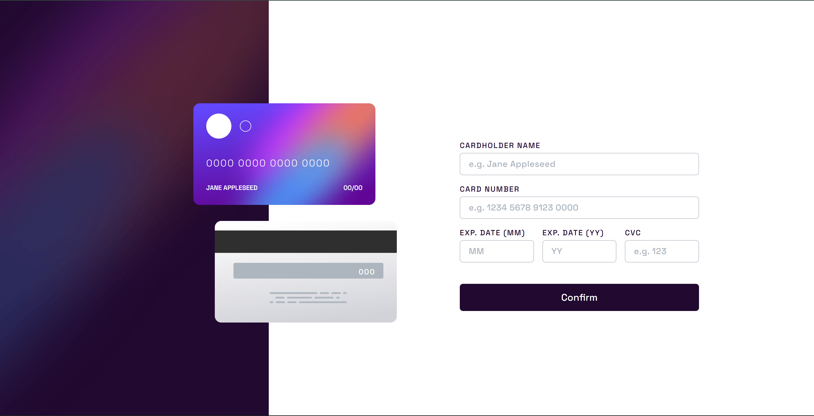

# Frontend Mentor - Interactive Card Details Form Solution

This project is part of the Frontend Mentor challenges and was assigned by AltSchool to enhance my practical skills in web development. This particular challenge helps me get accustomed to using TypeScript.

## Table of contents

- [Overview](#overview)
  - [The challenge](#the-challenge)
  - [Screenshot](#screenshot)
  - [Links](#links)
- [My process](#my-process)
  - [Built with](#built-with)
  - [What I learned](#what-i-learned)
  - [Continued development](#continued-development)
  - [Useful resources](#useful-resources)
- [Author](#author)

## Overview

### The challenge

The task is to build an interactive card details form where users can fill in their card details and see real-time updates. Error messages should appear if fields are empty or invalid. The layout must be responsive and should display interactive states like hover and focus.

### Screenshot

### Links

- Solution URL: [GitHub Repository](https://github.com/Reuben-10/interactive-card-details-form)
- Live Site URL: [Live Demo on Vercel](https://interactive-card-details-form-reuben.vercel.app/)

## My process

### Built with

- Semantic HTML5
- CSS custom properties, Flexbox, and Grid
- Mobile-first workflow
- [React](https://reactjs.org/) - A JavaScript library for building user interfaces
- [TypeScript](https://www.typescriptlang.org/) - Typed JavaScript at Any Scale
- [Vite](https://vitejs.dev/) - A fast build tool and development server

This project helps me familiarize myself with TypeScript by applying strong typing to build a maintainable codebase. It also reinforces modern frontend practices by using React and Vite, ensuring efficiency and optimal performance in development.

### What I learned

The project allowed me to deepen my understanding of handling form validation and dynamic updates with TypeScript and React. The implementation of type safety prevents common errors and enhances code maintainability.

### Continued development

I plan to focus more on integrating TypeScript with various libraries and frameworks to solidify my understanding of type-safe development.

### Useful resources

- [**The TypeScript Handbook**](https://www.typescriptlang.org/docs/handbook/intro.html) – This has been my main reference for understanding the core concepts of TypeScript. I often revisit it whenever I need clarity on fundamentals.

- [**React TypeScript Cheatsheets**](https://react-typescript-cheatsheet.netlify.app/) – I use this a lot when working with React projects. It gives me quick examples and patterns that make my development process smoother.

- [**Total TypeScript**](https://www.totaltypescript.com/) – A great platform with interactive tutorials and practical examples for learning and improving TypeScript skills.

## Author
- Frontend Mentor - [@Reuben-10](https://www.frontendmentor.io/profile/Reuben-10)
- Twitter - [@reuben_agbor](https://twitter.com/yourusername)
- GitHub - [@Reuben-10](https://github.com/Reuben-10)

